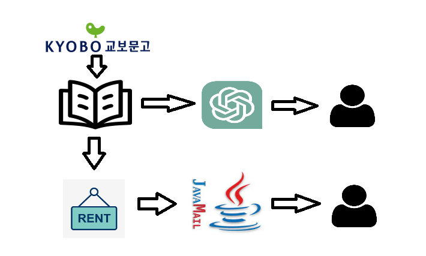

# IntelliBooks [javaFxProject]
We make IntelliBooks kiosk project for java FX 

## 1. 목표 및 내용 
   도서 대여는 여전히 전통적인 방식으로 이루어져 있으며, 사용자들은 도서관이나 서점에서 도서를 빌리거나 반납하는 과정에서 여러 가지 불편을 겪고 있음. 이러한 불편함은 주로 도서 위치 파악의 어려움, 대여 및 반납 프로세스의 번거로움, 결제 과정의 제한 등으로 나타남.
   이러한 문제를 없애고 AI 기술을 통합하여 혁신적으로 향상시키는 인텔리북스(Intelligent + Books)는 편리하고 안전한 도서 대여 경험을 제공하는 통합 AI 도서 키오스크 및 결제 시스템을 구축함. 사용자 편의성과 직관성을 향상시키며, 다양한 결제 수단 및 안전한 결제 프로세스를 제공하고 지속적인 품질 향상과 사용자 만족도가 증대함. 이러한 최종 목표를 통해 독서를 즐기는 사용자들에게 혁신적이고 편리한 AI 서비스를 제공하며, 도서 대여의 장벽을 낮추고 도서관과 같은 장소에서의 도서 이용 경험을 현대화하는 것을 목표로 삼음.
 

### 버전
JAVA : JDK17.0.9 (gradle) 
JAVA FX : 21 
GPT API 
Java Mail  
Notion 
GitHub

   

IntelliBooks 주요 기능
---

### 구동법
알맞는 JDK 설정 후 외부 api의 key를 받아와 configClass 파일을 만들어 지정해 줘야한다.

